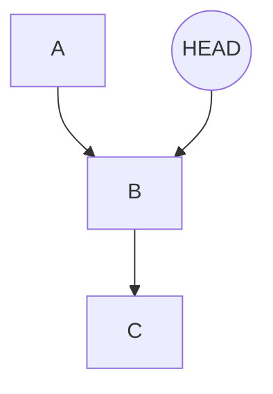

Git Tips
--------

#### What's different between ~ and ^


#### Git log

To see all commits from begin to current(A->B).
```bash
$ git log
```

To see all commits from current to end(B->C).
```bash
$ git log --ancestry-path HEAD^..master 
```



#### Git show #commit_id

To see the commit's detail.	

#### Git reset [HEAD file]

If you don't want to track the unstaged file, you can use `git reset [HEAD file]` to untrack.

#### Git reset HEAD~1

If you want to drop the last commit and the last change in that commit:

```
git reset HEAD~1
git checkout -- the_change_file
# or all the files
git checkout -- .
```

NOTE: The commit `HEAD~1` will be keep and all the changes in those commits after `HEAD~1` will be dropped if you checkout files.


#### Git revert #commit_id

To create a new commit that combines the commit before `#commit_id` and the commits after `#commit_id`.

If you meet conflict problem, you need to modify files and commit to finish the revert action.


#### Git ls-tree master submodule_dir

To see the `commit_id` about `submodule_dir` in master

### Git rebase -i #commit_id

To choose the commits you want after the commit `#commit_id`.

If you don't want to keep `D` commit, you should delete that line `pick D xxx` and save it.

```
pick D xxx
pick E ooo
```
