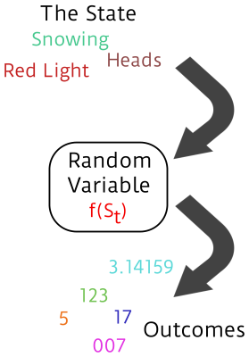
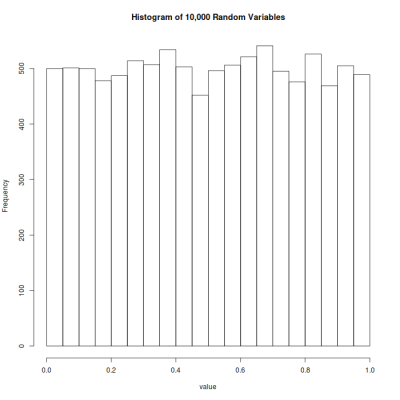
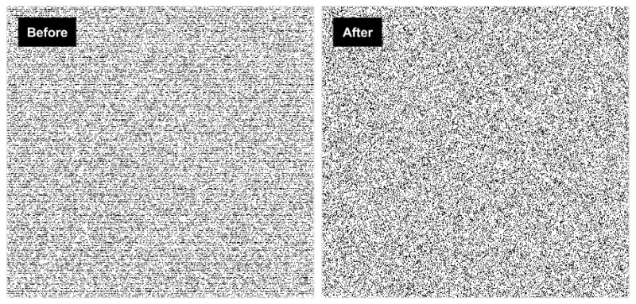

# V8 Javascript 修正了糟糕的隨機數產生方法
[translated from here](http://hackaday.com/2015/12/28/v8-javascript-fixes-horrible-random-number-generator/)

根據 V8 官方描述，V8 所用的 PRNG (pseudo-random number generator) 來實作 `Math.random()` 是十分糟糕的，V8 是 [Google 為了 Chrome 所開發的 Javascript 引擎](https://github.com/v8/v8)，除此之外這也用在 [Node.js](https://nodejs.org/en/) 以及其他地方，但是近六年來這樣的狀況卻是鮮少被注意，如今這問題已經有被提出以及改善。

在這裡，我會透過 pseudo-randomness 讓你了解數學上的隨機性，並且回顧 PRNG 缺點以及改進的地方。如果你在等待一個理由認識 [PRNGs](https://en.wikipedia.org/wiki/Pseudorandom_number_generator)，你可以從他為何不好以及如何修正來開始。

一開始，來看一段名言：

	許多人說到用算數方法來產生隨機數，當然這是有錯的。對此這種說法常被指出，沒有所謂的隨機數－你只能用一些方法來隨機產生一些數字，但是這些方法都不是嚴謹的算術方法。 - [John von Neumann](https://en.wikiquote.org/wiki/John_von_Neumann)

John von Neumann 不用多說就是一個天才。他對於隨機變數有深入且重要的說明以及相關的數學定義。


###RANDOM VARIABLES

在進階機率的課程上所學的是以數學家觀點來看隨機，所以對於 `random number` 任何上過課的人應曾經苦惱過，但這不是賣弄學問，這是基礎。

數字不是隨機的。從以前到現在，我們都知道他們是甚麼。我們用數字來計數。我們甚至把數字擴展到不可數的部分以及非實數的部分。但是有個部分數字無法表示，那就是隨機。7 還是 7，從亞里斯多德的時代到現在都是一樣的。畢竟，沒有隨機的觀點，數字更容易用在計數上。



如果想要用數學角度了解隨機，那麼就必須知道函數。我們可以從函數得到數字，這些數字不是隨機的，他們只是從隨機過程得到的結果。這個函數需要一個隨機性質的參數來產生。數學家曾表示 `隨機變數` 是一個函數，而他的值跟世界狀態是有相關的。如果說在時間 `t` 世界的相關狀態就是 `St`，那麼隨機變數就是 `xt = f(St)`

如果從現在 (time t) 到明天 (time t+1) 的世界狀態是不可預測的話，那麼明天所得到的隨機變數 x 也將不可預測。如果你說得出未來世界可能的狀態以及機率，那麼你也可以算出未來 x 的值。

現在假設我擲一個骰子，舉例來說，我可以非常確定各個面朝上的狀態在世界中的機率是多少，但我不能說我明天即將擲出三或四的點數。一旦擲出，所得到的就只是簡單的數字，4 永遠就是 4。

這也就是 von Neumann 所提到的＂...沒有所謂的隨機數字－只有一些方法可以去隨機產生數字...＂如果我們知道一種方法，這個方法可以數學方式從狀態 St 到 St+1 精準預測到時間 t 的結果，那麼明天的所有結果也就不會無法預測。

###PRNGS?
如果你可以寫下一段時間 St 的結果，那麼所設計的函數就不是隨機，因此所有計算機實作出來的 PRNGs 都不是隨機。這也是為什麼要加上虛擬的前綴詞。那麼他們又是甚麼，如果他們不能隨機，他們可以拿來做甚麼呢？這裡有三個準則，每個都建立在前一個準則上。



如果要拿 PRNG 來做點事情的話，你應該會想要輸出他所有可能的值。就像你拿到 8-bit PRNG，[1] 你會想要透過他取得在 0-255 範圍內的每個值，基於如此，[2] 你會希望每個可能的結果都有相同的出現頻率 (以一個 uniform PRNG 來說)，最後，[3] 即使你有著前幾次的結果，你仍然無法預測出下一次結果 (xt+1)。

一個 PRNG 涵蓋了所有可能出現的值，可說是 "full period"，然而所有的結果出現的頻率一致，我們可以說是 "equi-distributed"。這些準則對於數學或測試來說是相當的簡單明瞭－就只需要多幾次結果，再看看某幾個值是否出現很多次或者根本就沒出現。如果這個 PRNG 沒有涵蓋所有可能出現的值，那麼他就不是平均分布。如果他不是平均分布，你就可以作出有前提的預測；如果說 5 出現的頻率太高，就直接猜 5 就好。

然而預測這件事是有點微妙，現在已經有著很多有趣的統計測試工具來完成。預測這個字是有些用詞不精準，因為我們已經知道狀態會如何改變，只有當我們假裝不知道狀態 St+1，並且只從 x 的過去數據去猜，才能說是預測。但最終還是落入上述 von Neumann 的論調中。

###AND JAVASCRIPT
接下來看到 V8 Javascript 的 `Math.random()`。近六年來所用的演算法一直很糟糕。我們可以看看下面所產生的圖表，再想想那些不滿足剛剛所提到的三大準則？



如果你認為是 "full-period"，你答對了。因為看到圖上白色像素的部分就是沒有出現的數字，雖然可能還是需要產生更多的圖表來驗證。如果你是認為是 "equi-distribution"，那麼你也是對的。看到圖上有黑色類似線狀的紋理，就是數字沒有平均分布的結果。

最後，如果你是認為 "unpredictability"，你的答案可能都比上面還要來的好。這是因為圖上的黑色線狀紋理很顯然的呈現出水平的分布，意思是產生出的數字跟 y 軸有很明顯的相關，而跟 x 軸卻沒甚麼關係。由於在 y 軸分布的結果不是很好，所以你在預測下一個數字時，你可以選擇分布較密的那些數字，會比你亂猜的結果來的好。

基本上根據產生的圖表是沒有滿足任何一項的準則。
[產生圖片的程式](http://bl.ocks.org/mmalone/bf59aa2e44c44dde78ac)。 (可以測試你的瀏覽器的 PRNG)

將上述的觀察結果量化，以 64-bit float表示為 2^52 個平均分布的數字，上述連結的方法也只涵蓋了 2^32 個。當然這絕對不滿足 "full-period" 準則。


這是一個實際上會遇到的問題

再加上，每一次所選擇的週期都與開始的狀態過短。也就是說，這不是一個很隨機的狀態選擇，PRNG 相對所產生的數字範圍也會來的窄。目前 2^32 個數字看起來很大，當你了解到數字的數量其實是少了 2^20 倍時，你將近少了 99.999905% 的範圍。如果又遇到 [Birthday problem](https://en.wikipedia.org/wiki/Birthday_problem)，就又會讓這個問題更加嚴重。

對於 PRNGs 較佳的預測測試會希望在高維度的資料上進行，看看測試結果是否彼此都有不同的落差或是在這些不同結果中是否能夠拿來做預測。[TestU01](http://simul.iro.umontreal.ca/testu01/tu01.html) 是目前最新的 PRNG 測試工具，只要載下來，你就可以將想要測試的 PRNGs 用這個工具執行看看。另外個人最愛的工具還有 `[Diehard battery of tests](https://en.wikipedia.org/wiki/Diehard_tests)` 以及 `[Improved Dieharder battery](http://www.phy.duke.edu/~rgb/General/dieharder.php)`。但由於 PRNG 是一個不好理解的部分，所以就不去細看內容。

###WHAT HAPPENED?
Betable 首席技術長 Mike Malone 在他的 blog 中有提到一個[實際案例](https://medium.com/@betable/tifu-by-using-math-random-f1c308c4fd9d)。他公司的伺服器中使用了 Node.js 的 `Math.random()` 來產生每個 session 的 token 給使用者.他們覺得這是可行的，因為他們認為使用 PRNG 來實作， token 重複的機率幾乎是微乎其微。他們估計在未來的三百年發生重複的機率約六十億分之一。(但他們錯了－雖然說在有生之年可能不會看到重複，但是他們不可能在有限週期的狀態中得到在 2^64 範圍內的任一個數字。)

事實上，在二月推出的系統上他們在三月的時候就遇到了重複的狀況。
這也讓 [Mike] 去深入研究有缺陷的 PRNG。他指出一個有[先見之明的評論](https://codereview.chromium.org/126113)，[[Dean McNamee](https://codereview.chromium.org/126113)] 在 v8 有個針對修正缺陷 PRNG 的 issue 上說：

	我原本想用 [Mersenne Twister](https://en.wikipedia.org/wiki/Mersenne_Twister) 實作，因為其他語言也都是用這個演算法 (python、ruby 等等)。

這個 issue 的修正是使用一個滿奇怪的演算法 "MWC1616"。"MWC1616" 的作者是一位叫 [[George Marsaglia](https://en.wikipedia.org/wiki/George_Marsaglia)] ，, 他也是上面提到測試工具 Diehard tests 的作者，也是 Mersenne Twister 演算法的開法者，他在 1999 年一月十二號提出關於這個演算法的[一個版本](https://groups.google.com/forum/#!msg/sci.stat.math/5yb0jwf1stw/ApaXM3IRy-0J)，另外在一月二十號又提出了[一個改進的版本](https://groups.google.com/forum/#!msg/sci.math.num-analysis/yoaCpGWKEk0/UXCxgufdTesJ)。有人參考這篇文以及一些回覆又實作出一個更好的版本，這個最後版本還包含[數值分析](https://en.wikipedia.org/wiki/Numerical_Recipes)等等的方法。但是有些針對 V8 Javascript 的 PRNG 修正的版本卻不是使用最好的方法實作。

###WHAT’S NEXT?
後來這個 bug 還是被解決了。最終 V8 Javascript 是使用 [XorShift](https://en.wikipedia.org/wiki/Xorshift) generator 的演算法，應該是目前最新技術，而且都有通過上面提到的測試工具。再加上他很快，只需要一些 bit-shift 以及 XOR 的運算。目前這個演算法還很新，可能還有一些問題，但是以目前測試來說，結果相當不錯。

就跟 Chrome 一樣，[Mozilla](https://bugzilla.mozilla.org/show_bug.cgi?id=322529#c99) 跟 [Safari](https://bugs.webkit.org/show_bug.cgi?id=151641) 也都將 XorShift128+ 合併進原始碼，很快你將會有不錯的隨機方法。

如果你想了解關於 PRNGs ，這裡有一段 MWC1616 的程式碼 (不好的)：

```cpp
uint32_t state0 = 1;
uint32_t state1 = 2;
uint32_t mwc1616() {
  state0 = 18030 * (state0 & 0xffff) + (state0 << 16);
  state1 = 30903 * (state1 & 0xffff) + (state1 << 16);
  return state0 << 16 + (state1 & 0xffff);
}
```

還有 XorShift128+ 的程式碼 (好的)：

```cpp
uint64_t state0 = 1;
uint64_t state1 = 2;
uint64_t xorshift128plus() {
  uint64_t s1 = state0;
  uint64_t s0 = state1;
  state0 = s0;
  s1 ^= s1 << 23; s1 ^= s1 >> 17;
  s1 ^= s0;
  s1 ^= s0 >> 26;
  state1 = s1;
}
```

如果 PRNG 相關資訊已經引起你追求更真實的、更公正的隨機性，而且這個隨機性沒有所謂的已知狀態的話，有幾個不錯的方法你可以選擇：[放射性衰變](http://hackaday.com/2015/08/16/hackaday-prize-entry-nuclear-powered-random-number-generator/)、[綜合無線電雜訊以及量子隧道](http://hackaday.com/2014/10/31/dual-mode-avalanche-and-rf-random-number-generator/)。最後如果你想要的你的隨機性是被公認的，可以參考[美國NIST的隨機源](http://hackaday.com/2014/12/19/nist-randomness-beacon/) (Randomness Beacon)。
